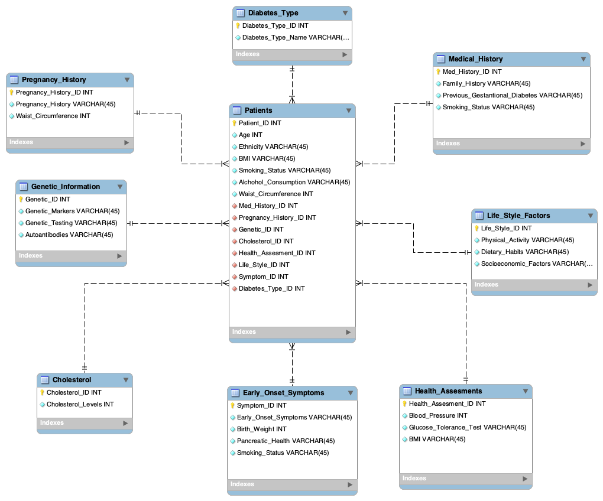

# Diabetes Risk Factor Database Management System

A relational database designed to analyze diabetes risk factors across patient populations. Built in MySQL with a normalized 9-table schema, complex analytical queries, and views for reporting on lifestyle, genetic, and clinical correlations.

Built for INST327: Data Sources and Manipulation at the University of Maryland (Spring 2025).

---

## What It Does

- Stores and queries patient health data across 9 normalized tables
- Analyzes correlations between lifestyle factors, genetics, and diabetes type
- Generates aggregate reports on cholesterol, BMI, blood pressure, and glucose tolerance
- Identifies patterns in family history, smoking status, and early onset symptoms
- Supports 13 distinct diabetes classifications including rare types (Wolfram Syndrome, LADA, MODY)

---

## Database Schema

9 tables, normalized to reduce redundancy and enforce referential integrity via foreign key constraints.



| Table | Description |
|---|---|
| `Patients` | Core table — age, ethnicity, BMI, waist circumference, foreign keys to all related tables |
| `Diabetes_Type` | 13 diabetes classifications (Type 1, Type 2, Gestational, LADA, MODY, etc.) |
| `Medical_History` | Family history, gestational diabetes history, smoking status |
| `Genetic_Information` | Genetic markers, genetic testing results, autoantibodies |
| `Life_Style_Factors` | Physical activity levels, dietary habits, socioeconomic factors |
| `Health_Assesments` | Blood pressure, glucose tolerance test results, BMI |
| `Early_Onset_Symptoms` | Birth weight, pancreatic health, smoking status, early symptoms |
| `Cholesterol` | Cholesterol level measurements |
| `Pregnancy_History` | Pregnancy history and waist circumference |

---

## Sample Queries

### Average cholesterol by diabetes type
```sql
SELECT
    COUNT(p.Patient_ID) AS 'Number of Patients',
    dtn.Diabetes_Type_Name AS 'Diabetes Type',
    MIN(c.Cholesterol_Levels) AS 'Min_Cholesterol',
    MAX(c.Cholesterol_Levels) AS 'Max_Cholesterol',
    ROUND(AVG(c.Cholesterol_Levels), 2) AS 'Average_Cholesterol'
FROM Patients p
    JOIN Diabetes_Type dtn ON p.Diabetes_Type_ID = dtn.Diabetes_Type_ID
    JOIN Cholesterol c ON p.Cholesterol_ID = c.Cholesterol_ID
GROUP BY dtn.Diabetes_Type_Name
ORDER BY Average_Cholesterol DESC;
```

### BMI and Type 2 Diabetes correlation
```sql
SELECT
    CASE
        WHEN p.BMI >= 30 THEN 'Obese'
        WHEN p.BMI >= 25 THEN 'Overweight'
        ELSE 'Normal/Underweight'
    END AS Weight_Category,
    COUNT(p.Patient_ID) AS Total_Patients,
    SUM(CASE WHEN dt.Diabetes_Type_Name = 'Type 2' THEN 1 ELSE 0 END) AS Type2_Count,
    ROUND((SUM(CASE WHEN dt.Diabetes_Type_Name = 'Type 2' THEN 1 ELSE 0 END)
        / COUNT(p.Patient_ID)) * 100, 2) AS Type2_Percentage
FROM patients p
    JOIN Diabetes_Type dt ON p.Diabetes_Type_ID = dt.Diabetes_Type_ID
WHERE p.BMI IS NOT NULL
GROUP BY Weight_Category
ORDER BY Type2_Percentage DESC;
```

### Top genetic markers linked to Steroid-Induced Diabetes
```sql
SELECT
    COUNT(p.Patient_ID) AS 'Number of Patients',
    gm.Genetic_Markers AS 'Genetic Markers',
    dtn.Diabetes_Type_Name AS 'Type of Diabetes'
FROM Patients p
    JOIN Diabetes_Type dtn ON p.Diabetes_Type_ID = dtn.Diabetes_Type_ID
    JOIN Genetic_Information gm ON p.Genetic_ID = gm.Genetic_ID
WHERE Diabetes_Type_Name = 'Steroid-Induced Diabetes'
GROUP BY gm.Genetic_Markers
ORDER BY COUNT(p.Patient_ID) DESC;
```

See [`queries.sql`](queries.sql) for all 12 analytical views.

---

## Tech Stack

| Component | Technology |
|---|---|
| Database | MySQL 8.0 |
| IDE | MySQL Workbench |
| Normalization | 3NF (Third Normal Form) |
| Query types | JOINs, subqueries, aggregates, UNION, CASE, views |

---

## Local Setup

### Prerequisites
- MySQL 8.0+
- MySQL Workbench (recommended)

### Import the database

```bash
mysql -u root -p < team_3_team3_diabetes_final_backup.sql
```

Or in MySQL Workbench:
1. Go to **Server → Data Import**
2. Select **Import from Self-Contained File**
3. Choose `team_3_team3_diabetes_final_backup.sql`
4. Click **Start Import**

### Run the queries

```sql
USE Team3_Diabetes_Final;
SOURCE queries.sql;
```

---

## Key Analytical Views

| View Name | What It Answers |
|---|---|
| `Diabetes_Cholesterol_Average` | Average, min, and max cholesterol levels by diabetes type |
| `Lifestyle_Wolfram_Syndrome` | Lifestyle patterns most associated with Wolfram Syndrome |
| `Genetic_Markers_SID` | Top genetic markers linked to Steroid-Induced Diabetes |
| `Most_Common_Diabetes` | Most frequently occurring diabetes types in the dataset |
| `Family_History_Counts` | Patients with and without family history of diabetes |
| `Type_1_diabetes_genetic` | Type 1 patients with positive genetic markers |
| `Prediabetes_Avg_age` | Average age of prediabetic patients |
| `Patient_Smoking_Status` | Patient count by smoking status |
| `diabetes_bmi_correlation` | BMI and waist circumference by diabetes type |
| `young_old_patients` | Youngest and oldest patients in the dataset |

---

## Ethical Considerations

All patient data is anonymized. The database was designed with fairness, privacy, and inclusivity in mind — no personally identifiable information is stored, and patient IDs are integers with no external linkage.

---

## Files

| File | Description |
|---|---|
| `team_3_team3_diabetes_final_backup.sql` | Full MySQL database dump — schema + data |
| `queries.sql` | All 12 analytical views and queries |
| `Diabetes_Database_Normalization.xlsx` | Normalization planning spreadsheet |
| `screenshots/schema_diagram.png` | Entity-relationship diagram from MySQL Workbench |

---

## Team

Samgwaa Lesiga, Areana Holder, Renee Jun, Odera Okafor, and Brandon Cartegena — INST327, University of Maryland, Spring 2025
